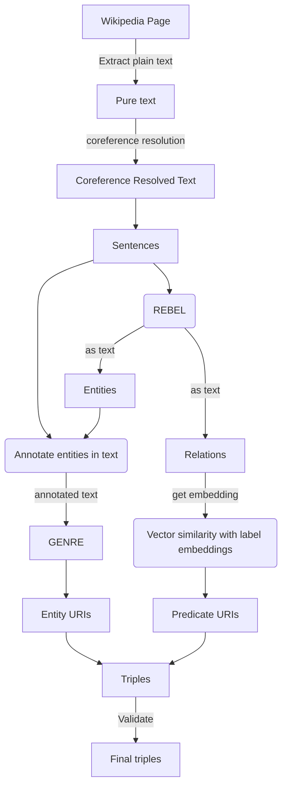

# Neural Extraction Framework @DBpedia - GSoC 2023

|   Project Details     | |
|-------------|-------------|
| GSoC Project | [Neural Extraction Framework GSoC'23 @DBpedia](https://summerofcode.withgoogle.com/programs/2023/projects/cKuagkf8)        |
| Contributor | [Aakash Thatte](https://www.linkedin.com/in/aakash-thatte/) |
| Mentors | [Tommaso Soru](https://github.com/mommi84), [Diego Moussallem](https://github.com/DiegoMoussallem), [Ziwei Xu](https://github.com/zoeNantes)|
| Blogs | [GSoC-2023 Aakash Thatte](https://sky-2002.github.io/) |

### Code structure
All directories contain a `notebooks` directory which has notebooks with exploration/experimentation code for the models and methods used. 
```
📦GSoC23
 ┣ 📂CoreferenceResolution
 ┣ 📂Data
 ┣ 📂EntityLinking
 ┣ 📂NER
 ┣ 📂RelationExtraction
 ┣ 📂Validation
```

### Installations 
I have provided the requirements file, but you can go ahead with only the packages below as well.
```
!pip install wikipedia
!pip install transformers
!pip install nltk
!pip install fuzzywuzzy
!pip install rdflib
!pip install SPARQLWrapper
!pip install redis
!pip install thefuzz
!pip install levenshtein
```

For spacy `en_core_web...` models,
use `spacy.download('en_core_trf')`

### Project workflow
