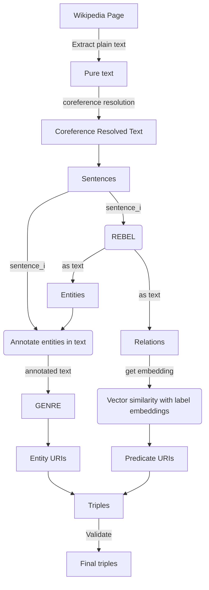

# Neural Extraction Framework @DBpedia - GSoC 2023

|   Project Details     | |
|-------------|-------------|
| GSoC Project | [Neural Extraction Framework GSoC'23 @DBpedia](https://summerofcode.withgoogle.com/programs/2023/projects/cKuagkf8)        |
| Contributor | [Aakash Thatte](https://www.linkedin.com/in/aakash-thatte/) |
| Mentors | [Tommaso Soru](https://github.com/mommi84), [Diego Moussallem](https://github.com/DiegoMoussallem), [Ziwei Xu](https://github.com/zoeNantes)|
| Blogs | [GSoC-2023 Aakash Thatte](https://sky-2002.github.io/) |

### What is Neural Extraction Framework?
[DBpedia](https://www.dbpedia.org/) is a knowledge base constructed by parsing the infoboxes present on wikipedia pages. This knowledge base consists of [relational triples](https://en.wikipedia.org/wiki/Semantic_triple) extracted using the infoboxes(which are structured information). There can be more information present in the wikipedia article text which needs to be extracted so as to mine hidden relationships between entities(wikipedia articles). 

The aim of this project is to extract all those triples from the wikipedia article text using SOTA NLP methods for entity and relation extraction, entity linking, relationship matching etc. We have been able to successfully create an end-2-end pipeline to extract triples given a wikipedia page.

**This project couldn't be possible without these amazing models, expressing our gratitude!**:
- [REBEL](https://github.com/Babelscape/rebel) - For joint entity-relation extraction
- [GENRE](https://github.com/facebookresearch/GENRE) - For autoregressive entity-linking
### Code structure
All directories contain a `notebooks` directory which has notebooks with exploration/experimentation code for the models and methods used. 
```
📦GSoC23
 ┣ 📂CoreferenceResolution
 ┣ 📂Data
 ┣ 📂EntityLinking
 ┣ 📂NER
 ┣ 📂RelationExtraction
 ┣ 📂Validation
```

### Installations 
Run the command below to install all requirements of the project at once(preferably in a virtual environment).
```
!pip install -r requirements.txt
```

For downloading all models(from spacy, huggingface transformers etc), use the command below.
```
python models.py
```

### Run from command line
We also provide an option to run the code from the command line with possibilities to only run it on a single sentence, or a text or a wikipedia page.
```
python end-2-end-use.py --text "Washinton is a city in the USA. Barack Obama was the president of the United states of America." --v 0 --save_filename "usage.csv"
```

### Project workflow


### Future scope
This project has been successful in creating an end-2-end pipeline for triple extraction. But there is a need to make this work faster. Due to the DL/ML models that are being used in this project, the time consumption is quite high(somewhere around 1.8 seconds for a single triple). A good enhancement to this project would be to use some distributed processing framework(for example, SparkNLP) to make this code run on a cluster of machines so as to get faster results.

Some good enhancements to the project could be:
- A thorough data analysis of the wikipedia page texts, the relations extracted, the types of entities extracted, the domain and range of relations, literals etc needs to be done in order to understand the data at hand better, so as to apply the methods that are more relavant. For example, if there is some pattern in some type of relations, we can have a separate method to extract those.
- Make downloading and caching of models more organized and efficient.
- Define a structure/schema to store extracted triples and push to DBpedia.
- Dockerize the framework, so that anyone can use the dockerfile and run it on a set of wikipedia pages to test or use.