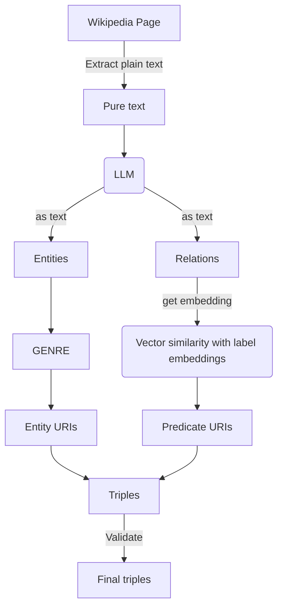

# Neural Extraction Framework @DBpedia - GSoC 2023

|   Project Details     |                                                                                                                                                                                               |
|-------------|-----------------------------------------------------------------------------------------------------------------------------------------------------------------------------------------------|
| GSoC Project | [Neural Extraction Framework GSoC'24 @DBpedia](https://summerofcode.withgoogle.com/programs/2024/projects/J4tJODFV)                                                                           |
| Contributor | [Abdulsobur Oyewale](https://www.linkedin.com/in/abdul-sobur-oyewale/)                                                                                                                        |
| Mentors | [Tommaso Soru](https://github.com/mommi84), [Yogesh Kulkarni](https://github.com/yogeshhk), [Ziwei Xu](https://github.com/zoeNantes), [Mehrzad Shahinmoghadam](https://github.com/mehrzadshm) |
| Blogs | [GSoC-2024 Abdulsobur Oyewale](https://smilingprogrammer.github.io/GSoC-2024-blog/)                                                                                                                                   |

### What is Neural Extraction Framework?
[DBpedia](https://www.dbpedia.org/) is a knowledge base constructed by parsing the infoboxes present on wikipedia pages. This knowledge base consists of [relational triples](https://en.wikipedia.org/wiki/Semantic_triple) extracted using the infoboxes(which are structured information). There can be more information present in the wikipedia article text which needs to be extracted so as to mine hidden relationships between entities(wikipedia articles). 

The aim of this project is to extract all those triples from the wikipedia article text using SOTA NLP methods for entity and relation extraction, entity linking, relationship matching etc. We have been able to successfully create an end-2-end pipeline to extract triples given a wikipedia page.

**This project couldn't be possible without these amazing models, expressing our gratitude!**:
- [Hermes-Llama](https://huggingface.co/models?search=hermes) - Using the LLM for entity-relation extraction
- [GENRE](https://github.com/facebookresearch/GENRE) - For autoregressive entity-linking
### Code structure
All directories contain a `notebooks` directory which has notebooks with exploration/experimentation code for the models and methods used. 
```
📦GSoC24
 ┣ 📂Data
 ┣ 📂EntityLinking
 ┣ 📂NER
 ┣ 📂RelationExtraction
 ┣ 📂Validation
```

### Installations 
Run the command below to install all requirements of the project at once(preferably in a virtual environment).
```
!pip install -r requirements.txt
```

For downloading models from huggingface, use the command below.
```
python models.py
wget https://hf.co/NousResearch/Hermes-2-Pro-Llama-3-8B-GGUF/resolve/main/Hermes-2-Pro-Llama-3-8B-Q4_K_M.gguf
```

### Run from command line
You can run the code from the command line with the ability to run it on a single sentence, or a text file or a wikipedia page.
```
python end-2-end-use.py --text "Donald John Trump (born June 14, 1946) is an American politician, media personality, and businessman who served as the 45th president of the United States from 2017 to 2021.Trump received a Bachelor of Science degree in economics from the University of Pennsylvania in 1968." --v 0 --save_filename "generated_triples.csv"
```
Or to run on a text file,
```
python end-2-end-use.py --text_filepath "e2e.txt" --v 0 --save_filename "triples_from_file.csv"
```

[//]: # (### Example of using the command line utility:)

[//]: # ()
[//]: # (https://github.com/dbpedia/neural-extraction-framework/assets/84656834/306dc5ae-ff43-404c-bac3-5f77a6ffd3a9)


### Project workflow


### Future scope
This project has been successful in developing a new technique of entity-relation extraction in the field of knowledge graph, and improve the previous end-2-end pipeline for triple extraction. But there is a need to make this work faster. Due to the quantized models that we used in this project, the time consumption is quite high. A good enhancement to this project would be to use of libraries that can smoothly run a quantized model on a GPU, or make use of an unquantized LLM and perform its inference on a GPU.
