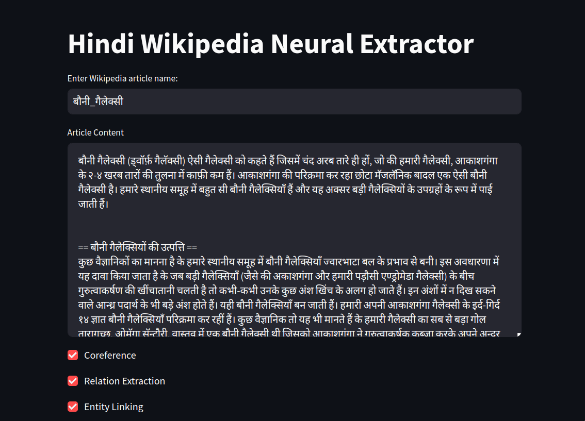
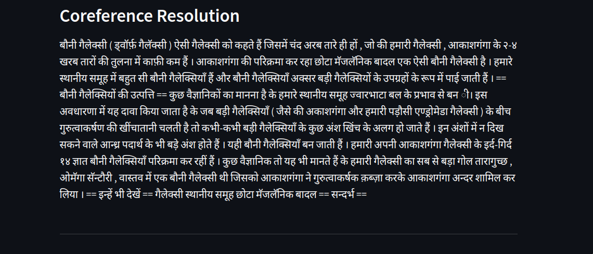
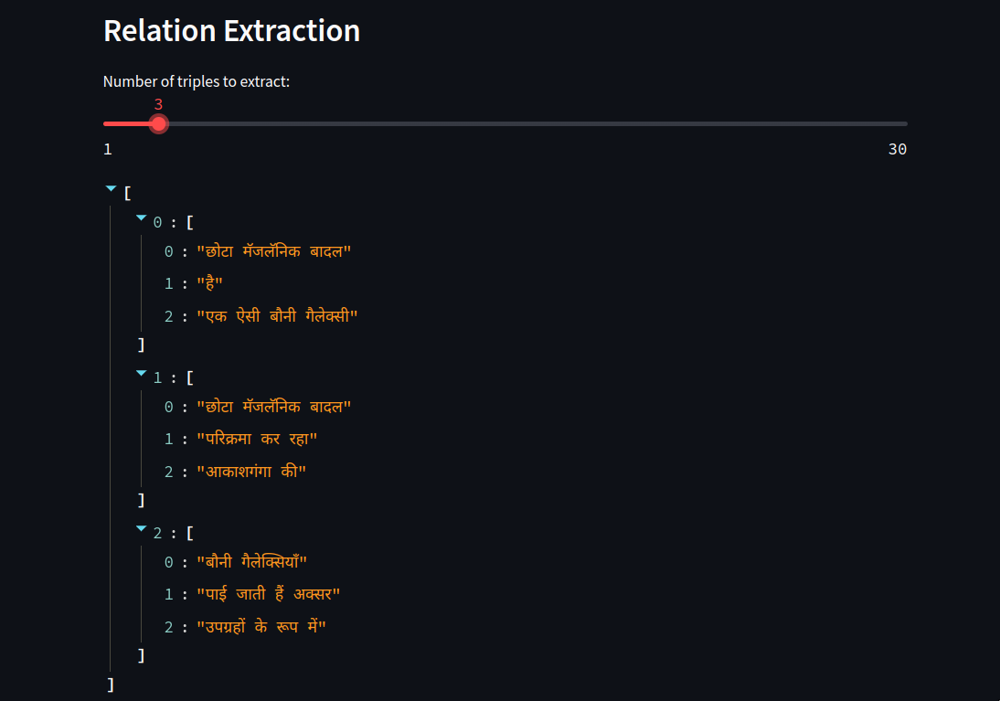
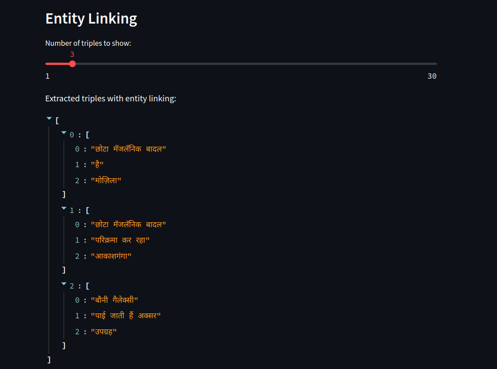
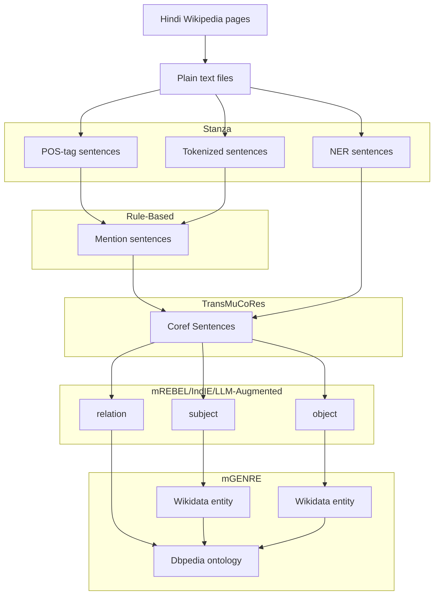

# Neural Hindi Wiki Triple Extraction Pipeline

This project aims to develop a relation extraction pipeline for Hindi Wikipedia articles, utilizing a combination of state-of-the-art language models and rule-based methods. The goal is to extract meaningful subject-relation-object triples and link them to DBpedia entities and DBpedia ontology.

Weekly Blog: https://deba-iitbh.github.io/deba-gsoc24/

## TL;DR

The Demo pictures are attached below.

## Project Workflow

## Progress Overview

### Week 15-19 July

**DONE:**

- Loading articles from Wikipedia.
- POS tagging using Stanza.
- NER tagging using IndicNER model.
- Relation extraction using IndicNER.

### Week 22-26 July

**DONE:**

- LLM-based Coreference Resolution.
- LLM-based Relation Extraction.

### Week 29 July-2 Aug

**DONE:**

- mGENRE setup.
- Streamlit Demo setup.

## Components

### [Stanza](https://stanfordnlp.github.io/stanza/)

Used for POS tagging, tokenization, and NER tagging of sentences extracted from Hindi Wikipedia.

## [TransMuCoRes](https://github.com/ritwikmishra/transmucores)

Library for multilingual Coreference Resolution in Low-resource South Asian Languages.

### [mREBEL](https://github.com/Babelscape/rebel)/[IndIE](https://github.com/ritwikmishra/IndIE)/LLM-Augmented

This module identifies the subject, relation, and object from the processed sentences.

### [mGENRE](https://github.com/facebookresearch/GENRE)

Responsible for linking the extracted entities and relations to Wikidata entities and DBpedia ontology.

## Future Work

- Refine the pipeline for enhanced accuracy.
- Extend the pipeline to support additional languages.
