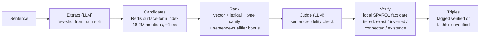

# Neural Extraction Framework 2.0 (NEF 2.0)

| **Project Details** | |
|---|---|
| GSoC Project | [Neural Extraction Framework GSoC'26 @DBpedia](https://github.com/dbpedia/neural-extraction-framework/tree/main/GSoC26) |
| Contributor | [Nakul Singh](https://github.com/NakulSingh156) |
| Mentors | Tommaso Soru, Ara Yeroyan, Mayank Kejriwal, Nandana Mihindukulasooriya |
| Blog | [nakulsingh156.github.io](https://nakulsingh156.github.io) |

**GSoC 2026 · DBpedia** — the next iteration of DBpedia's Neural Extraction
Framework: an LLM + knowledge-base pipeline that turns natural-language
sentences into verified DBpedia triples, fully offline except the LLM call.

> **Text2KGBench (dbpedia_webnlg), all 19 domains: macro F1 = 0.6317** — matching the
> published GPT-4o NEF baseline (0.628) on a model **~20× cheaper per token**, at
> **~3–4× lower end-to-end cost** (≈ $8–10 vs ≈ $30–35 for the full benchmark) —
> while spending ~10× more LLM calls per sentence on judging and verification.
> Leads the baseline outright on 8 of 19 domains.

```bash
docker pull ghcr.io/nakulsingh156/neural-extraction-framework:v2.0
```

## Project goals

NEF 1.0 (GSoC'25) established that an LLM plus DBpedia could turn prose into
triples, but depended on live external services for entity linking and had no
way to tell a correct extraction from a confident hallucination. NEF 2.0 set out
to close both gaps:

1. **Remove the external dependency.** Replace live DBpedia Lookup calls with a
   local surface-form index, so entity resolution is millisecond-fast,
   reproducible, and works offline.
2. **Make every triple accountable.** Verify each output against DBpedia and tag
   it `verified` or `faithful-unverified`, so a fact asserted by the sentence but
   absent from the KB is preserved as new knowledge rather than deleted as noise.
3. **Extract every fact in a sentence**, not just one relation per sentence.
4. **Match the GPT-4o baseline at materially lower cost**, on Text2KGBench
   `dbpedia_webnlg`, 19 domains, 2,014 sentences, exact-triple F1.
5. **Ship something DBpedia can actually run**: containerised, documented,
   reproducible from a single command.

All five were met. Macro F1 **0.6317** against the published GPT-4o baseline's
0.628, at ≈3–4× lower end-to-end cost, with the full stack running offline apart
from the LLM call. Work beyond these goals, the open-domain Wikipedia-scale
study and anonymous-node grounding is in *Future work* below.

## How it works



- **Local surface-form index** — 16.2M DBpedia mentions (labels, redirects, anchors)
  in Redis; replaces the live Lookup API. Obscure entities become resolvable, and an
  empty lookup is a reliable "not an entity → quote as literal" signal.
- **Local SPARQL fact gate** — a local oxigraph load of DBpedia answers tiered
  verification queries in milliseconds (vs ~120 s/sentence against dbpedia.org).
- **Faithfulness principle** — a triple that is true *per the sentence* but absent
  from DBpedia is kept as a *faithful extraction*, not deleted as a hallucination;
  every output triple carries its verification status.
- **Zero fine-tuning** — per-domain quoting conventions, predicate aliases, and value
  formats are learned automatically from the benchmark's train split.
- **Sense disambiguation from context** — "Train's hit Mermaid" resolves to
  `Mermaid_(Train_song)`, not the sea creature: qualified index lookups are generated
  from the sentence's own words.

## Results

| | |
|---|---|
| Benchmark | [Text2KGBench](https://github.com/cenguix/Text2KGBench) `dbpedia_webnlg` (ISWC 2023) — 19 domains, 2,014 sentences, exact-triple metric |
| **Macro F1** | **0.6317** (frozen tag `v14-final`; per-domain scores in `results/final_clean/`) |
| Baseline | NEF with GPT-4o: 0.628 (model ~20× the per-token price; ≈$30–35 full-benchmark spend vs our ≈$8–10) |
| Model | `openai/gpt-5.6-luna` via OpenRouter, temperature 0 — endpoint swappable to any OpenAI-compatible API, incl. local vLLM/Ollama for a 100% offline deployment |
| Runtime | ~27 s/sentence, full benchmark ~16 h unattended on one 8 GB VPS |

**Full final report: [`REPORT.md`](REPORT.md)** — per-domain table vs the GPT-4o
baseline, cost analysis, engineering journey, limitations.
Fix history: [`CHANGES.md`](docs/CHANGES.md) · regeneration recipe: [`REPRODUCIBILITY.md`](docs/REPRODUCIBILITY.md).

## Run it

**As a service (Docker):** see [`deploy/DEPLOY.md`](deploy/DEPLOY.md) — three containers
(Redis index, oxigraph store, pipeline API) behind one endpoint:

```bash
curl -X POST localhost:8000/extract -H "Content-Type: application/json" \
  -d '{"text": "The song Mermaid is by the band Train."}'
# → {"triples": [{"sub": "Mermaid_(Train_song)", "rel": "artist", "obj": "Train_(band)"}], ...}
```

**Benchmark reproduction:** `REPRODUCIBILITY.md` has the full recipe;
`chunked_runner.py` drives per-domain runs with incremental saves.

## Repository layout

| Path | What |
|---|---|
| `src/autonomous_pipeline_v13.py` | The pipeline (extraction → linking → ranking → judge → gate → emitter) |
| `src/surface_index.py`, `src/chunked_runner.py`, `src/text2kg_harness.py` | Index query · benchmark harness (chunked runs, train-split learning, scoring) |
| `scripts/` | Index build tooling (`build_index.py`, `build_popularity.py`, `download_dumps.py`, import/export) |
| `deploy/` | Dockerfile, compose (volume + bind-mount modes), API server, operator guide |
| `data/dbpedia.owl` | Ontology snapshot (predicate linking, datatype rules) |
| `results/final_clean/` · `results/ablations/` | Final frozen sweep · ablation runs |
| `docs/` | `CHANGES.md` fix history · `REPRODUCIBILITY.md` recipe · `RUNBOOK.md` ops notes |
| `tests/` · `examples/` | Offline validation tests · Phase-0 abstract traces |
| `REPORT.md` · `SCALING_PROPOSAL.md` · `GSOC_SUBMISSION.md` | Final report · Wikipedia-scale study · submission text |

## Merged upstream

All work is merged into DBpedia's official repository — this directory *is* the
contribution, not a fork or a mirror.

| PR | Scope | Files |
|---|---|---|
| [#59](https://github.com/dbpedia/neural-extraction-framework/pull/59) | NEF 2.0 — pipeline, local index, SPARQL gate, benchmark results, docs, tests | 117 |
| [#32](https://github.com/dbpedia/neural-extraction-framework/pull/32) | Docker packaging and deployment | 26 |
| [#65](https://github.com/dbpedia/neural-extraction-framework/pull/65) | Scaling proposal — 5,000-abstract stratified corpus study + sampling script | 2 |
| [#64](https://github.com/dbpedia/neural-extraction-framework/pull/64) | Scaling proposal — method/model confound flagged, controlled experiment specified | 1 |
| [#62](https://github.com/dbpedia/neural-extraction-framework/pull/62) | Final benchmark report corrections | 1 |
| [#60](https://github.com/dbpedia/neural-extraction-framework/pull/60), [#61](https://github.com/dbpedia/neural-extraction-framework/pull/61) | README — future-work roadmap | 2 |

**Commit history:**
[all commits touching `GSoC26/`](https://github.com/dbpedia/neural-extraction-framework/commits/main/GSoC26)
· [all pull requests](https://github.com/dbpedia/neural-extraction-framework/pulls?q=is%3Apr+author%3ANakulSingh156)


## Future work

- **Anonymous-node grounding** — the deepest open problem in text-to-KG extraction:
  sentences assert facts about entities they never name (*"Marie Antoinette's
  husband was killed in the war"*). The plan: represent the unnamed entity as a
  **blank node with constraints — i.e. as a query** — and ground it against the
  local store *only when the answer is unique* (`?x : spouse(Marie_Antoinette, ?x)`
  → `Louis_XVI`, tagged as KB-grounded inference, distinct from extraction).
  Ambiguous or unanswerable descriptions stay as provenance-tagged blank nodes —
  the faithfulness principle extended to identity itself. A scoped implementation
  plus a purpose-built test set (named-entity gold rewritten into descriptions) is
  the planned flagship contribution of a publication.
- **Wikipedia-scale extraction** — running the pipeline over all 4.64 M English
  abstracts (≈10.5 M sentences) to produce a provenance-tagged Databus dataset:
  full phased cost/time study in [`SCALING_PROPOSAL.md`](SCALING_PROPOSAL.md),
  first traced examples already in [`examples/`](examples/).
- **Generalisation** — the `wikidata_tekgen` half of Text2KGBench, testing the
  approach beyond DBpedia.
- **Model-scaling ablation** — same pipeline with GPT-4o and with self-hosted open
  models, isolating pipeline contribution from model contribution.
