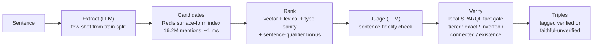

# Neural Extraction Framework 2.0 (NEF 2.0)

**GSoC 2026 · DBpedia** — the next iteration of DBpedia's Neural Extraction
Framework: an LLM + knowledge-base pipeline that turns natural-language
sentences into verified DBpedia triples, fully offline except the LLM call.

> **Text2KGBench (dbpedia_webnlg), all 19 domains: macro F1 = 0.6317** — matching the
> published GPT-4o NEF baseline (0.628) on a model **~20× cheaper per token**, at
> **~3–4× lower end-to-end cost** (≈ $8–10 vs ≈ $30–35 for the full benchmark) —
> while spending ~10× more LLM calls per sentence on judging and verification.
> Leads the baseline outright on 8 of 19 domains.

```bash
docker pull ghcr.io/nakulsingh156/neural-extraction-framework:v2.0
```

## How it works



- **Local surface-form index** — 16.2M DBpedia mentions (labels, redirects, anchors)
  in Redis; replaces the live Lookup API. Obscure entities become resolvable, and an
  empty lookup is a reliable "not an entity → quote as literal" signal.
- **Local SPARQL fact gate** — a local oxigraph load of DBpedia answers tiered
  verification queries in milliseconds (vs ~120 s/sentence against dbpedia.org).
- **Faithfulness principle** — a triple that is true *per the sentence* but absent
  from DBpedia is kept as a *faithful extraction*, not deleted as a hallucination;
  every output triple carries its verification status.
- **Zero fine-tuning** — per-domain quoting conventions, predicate aliases, and value
  formats are learned automatically from the benchmark's train split.
- **Sense disambiguation from context** — "Train's hit Mermaid" resolves to
  `Mermaid_(Train_song)`, not the sea creature: qualified index lookups are generated
  from the sentence's own words.

## Results

| | |
|---|---|
| Benchmark | Text2KGBench `dbpedia_webnlg` — 19 domains, 2,014 sentences, exact-triple metric |
| **Macro F1** | **0.6317** (frozen tag `v14-final`; per-domain scores in `results/final_clean/`) |
| Baseline | NEF with GPT-4o: 0.628 (model ~20× the per-token price; ≈$30–35 full-benchmark spend vs our ≈$8–10) |
| Model | `openai/gpt-5.6-luna` via OpenRouter, temperature 0 — endpoint swappable to any OpenAI-compatible API, incl. local vLLM/Ollama for a 100% offline deployment |
| Runtime | ~27 s/sentence, full benchmark ~16 h unattended on one 8 GB VPS |

**Full final report: [`REPORT.md`](REPORT.md)** — per-domain table vs the GPT-4o
baseline, cost analysis, engineering journey, limitations.
Fix history: [`CHANGES.md`](docs/CHANGES.md) · regeneration recipe: [`REPRODUCIBILITY.md`](docs/REPRODUCIBILITY.md).

## Run it

**As a service (Docker):** see [`deploy/DEPLOY.md`](deploy/DEPLOY.md) — three containers
(Redis index, oxigraph store, pipeline API) behind one endpoint:

```bash
curl -X POST localhost:8000/extract -H "Content-Type: application/json" \
  -d '{"text": "The song Mermaid is by the band Train."}'
# → {"triples": [{"sub": "Mermaid_(Train_song)", "rel": "artist", "obj": "Train_(band)"}], ...}
```

**Benchmark reproduction:** `REPRODUCIBILITY.md` has the full recipe;
`chunked_runner.py` drives per-domain runs with incremental saves.

## Repository layout

| Path | What |
|---|---|
| `src/autonomous_pipeline_v13.py` | The pipeline (extraction → linking → ranking → judge → gate → emitter) |
| `src/surface_index.py`, `src/chunked_runner.py`, `src/text2kg_harness.py` | Index query · benchmark harness (chunked runs, train-split learning, scoring) |
| `scripts/` | Index build tooling (`build_index.py`, `build_popularity.py`, `download_dumps.py`, import/export) |
| `deploy/` | Dockerfile, compose (volume + bind-mount modes), API server, operator guide |
| `data/dbpedia.owl` | Ontology snapshot (predicate linking, datatype rules) |
| `results/final_clean/` · `results/ablations/` | Final frozen sweep · ablation runs |
| `docs/` | `CHANGES.md` fix history · `REPRODUCIBILITY.md` recipe · `RUNBOOK.md` ops notes |
| `tests/` · `examples/` | Offline validation tests · Phase-0 abstract traces |
| `REPORT.md` · `SCALING_PROPOSAL.md` · `GSOC_SUBMISSION.md` | Final report · Wikipedia-scale study · submission text |

## Acknowledgements

Built during **Google Summer of Code 2026** with the **DBpedia** organisation, mentored
by **Ara Yeroyan** and **Tommaso Soru**. Benchmark: [Text2KGBench](https://github.com/cenguix/Text2KGBench)
(ISWC 2023). Baseline comparison: DBpedia NEF (GPT-4o).
