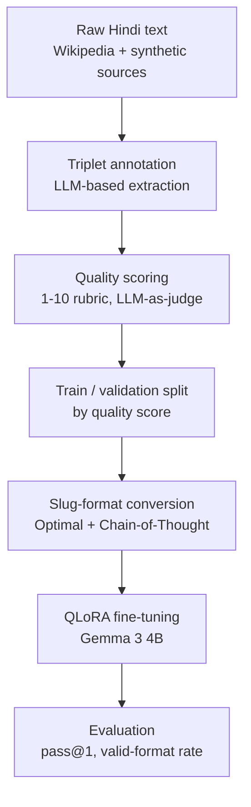

<div align="center">

# DBpedia Hindi Chapter

### Training pipeline for Hindi triple extraction


</div>

---

## Overview

This folder contains the training pipeline for a Hindi information extraction model: a small language model fine-tuned to read a Hindi sentence and output subject-relation-object triples, aligned to the DBpedia ontology — the same structured knowledge that powers DBpedia's English-language graph, now for Hindi.

---

## Pipeline



---

## Data sources

| Source | Description |
|---|---|
| Synthetic dataset | LLM-generated Hindi sentences with triple annotations |
| Noisy dataset | Additional synthetically generated sentences, mixed quality |
| Wikipedia | Real-world Hindi sentences scraped from Wikipedia articles |

---

## Annotation

Every sentence is annotated with subject-relation-object triples, including a dedicated `property` relation type for adjectives, possessives, and attributes — following exact-span extraction rules. No paraphrasing, no dropped postpositions.

---

## Quality scoring

Each annotated example is scored 1-10 by an LLM judge against four weighted criteria:

| Criterion | Weight |
|:---|:---:|
| Source sentence quality | 20% |
| Span exactness | 30% |
| Semantic correctness of core triplets | 30% |
| Property relation quality | 20% |

---

## Ontology alignment

A benchmark of **112 Hindi sentences** (**139 triples**) validates relation-to-property alignment. Each extracted relation is embedded with `e5-large-instruct`, matched against the DBpedia ontology by cosine similarity, and disambiguated by an LLM against the sentence context.

---

## Training data format

Triples are represented in pipe-separated **slug format** rather than JSON — the model is trained to generate this directly, with no post-processing conversion step:

```
subject | relation | object
```

Two trace types are generated per example:

| Trace type | Description |
|---|---|
| **Optimal** | Direct triple output |
| **Chain-of-thought (CoT)** | Step-by-step reasoning, then the triple output |

---

## Fine-tuning — Experiment 1

| Setting | Value |
|:---|:---|
| Base model | Gemma 3 4B |
| Method | QLoRA (4-bit quantized LoRA) |
| Learning rates | `2e-4` and `1e-5` — compared separately |
| Warmup ratio | `0.01` |
| Evaluation frequency | every `0.25` epoch, with checkpointing |
| Validation set | high-scoring Wikipedia sentences |
| Training set | all remaining data |
| Config management | Hydra |
| Experiment tracking | Weights & Biases |

---

## Folder structure

```
training/
├── README.md
├── configs/            # Hydra configuration groups
│   ├── config.yaml
│   ├── model/
│   ├── data/
│   ├── training/
│   └── logging/
├── prepare_data.py     # builds the train/validation split
├── train.py             # QLoRA fine-tuning entry point
└── evaluate.py           # pass@1 / valid-format-rate evaluation
```

---

## Methodology references

| Paper | Venue | Contribution |
|---|---|---|
| **KaLLM** | ACL 2024 | Small fine-tuned models outperforming larger general-purpose models on triple extraction |
| **REBEL** | EMNLP 2021 | End-to-end sequence generation instead of pipeline-based extraction |
| **GenIE** | NAACL 2022 | Schema-constrained generation for large-scale ontologies |

---

## Status

- [x] Data collection
- [x] Annotation pipeline
- [x] Quality scoring pipeline
- [x] Ontology alignment benchmark
- [ ] Wikipedia scoring — in progress
- [ ] Training data finalized
- [ ] Hydra configuration
- [ ] Training script
- [ ] Fine-tuning run
- [ ] Evaluation

---

<div align="center">

### Google Summer of Code 2026 — DBpedia
</div>
